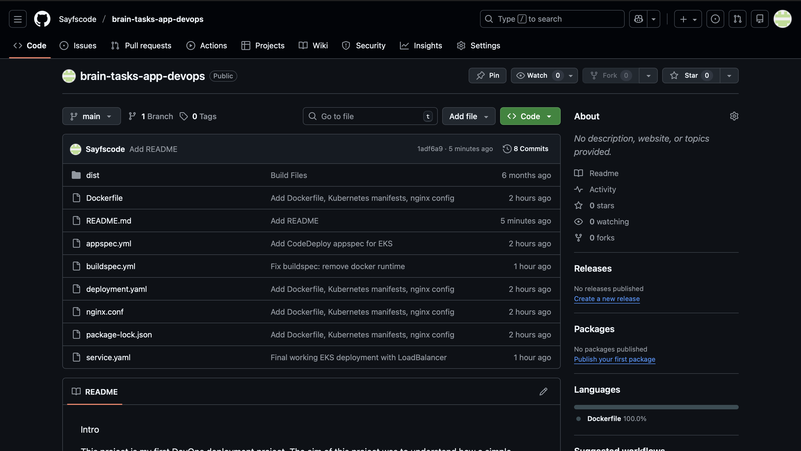

# Brain Tasks App — DevOps Deployment

A containerized React application deployed on AWS EKS (Kubernetes) with a fully automated CI/CD pipeline using AWS CodeBuild and ECR.

## Architecture

```
GitHub (Source Code)
    |
    v
AWS CodeBuild (CI/CD)
    |-- Builds Docker image
    |-- Tags with git commit SHA
    |-- Pushes to ECR
    v
AWS ECR (Container Registry)
    |
    v
AWS EKS (Kubernetes Cluster)
    |-- Deployment: 2 replicas with health checks
    |-- Service: LoadBalancer exposes app on port 80
    v
User accesses app via Load Balancer URL
```

## Tech Stack

| Tool | Purpose |
|------|---------|
| React | Frontend application |
| Docker | Containerization |
| Nginx | Web server (serves static files, SPA routing) |
| AWS ECR | Docker image registry |
| AWS EKS | Kubernetes cluster |
| AWS CodeBuild | CI/CD pipeline |
| AWS CloudWatch | Build and deployment logs |

## Project Structure

```
.
├── dist/                  # Built React application
├── k8s/
│   ├── deployment.yaml    # Kubernetes Deployment (2 replicas, resource limits, health probes)
│   └── service.yaml       # Kubernetes Service (LoadBalancer)
├── screenshots/           # Deployment evidence
├── Dockerfile             # Container image definition (Nginx, non-root, health check)
├── nginx.conf             # Nginx config (gzip, security headers, SPA routing)
├── buildspec.yml          # AWS CodeBuild pipeline definition
└── README.md
```

## CI/CD Pipeline

The pipeline triggers automatically when code is pushed to GitHub:

1. **CodeBuild** pulls the latest code from GitHub
2. **Docker image** is built and tagged with the git commit SHA for version tracking
3. Image is pushed to **ECR** (Elastic Container Registry)
4. Application is deployed to **EKS** using Kubernetes manifests

> CodeDeploy was initially planned but was replaced with direct `kubectl` deployment from CodeBuild due to account configuration constraints.

## Key DevOps Practices

- **No hardcoded credentials** — AWS Account ID is resolved dynamically in the build pipeline
- **Image versioning** — Each build is tagged with the git commit SHA, not just `latest`
- **Non-root container** — Nginx runs as a non-root user for security
- **Health checks** — Docker HEALTHCHECK and Kubernetes liveness/readiness probes ensure the app is running
- **Resource limits** — Kubernetes pods have CPU and memory limits to prevent resource exhaustion
- **Security headers** — Nginx adds X-Frame-Options, X-Content-Type-Options, and XSS protection headers
- **Gzip compression** — Reduces payload size for faster load times

## Screenshots

| Step | Screenshot |
|------|-----------|
| GitHub Repository |  |
| CodeBuild Success |  |
| ECR Image |  |
| EKS Cluster |  |
| Running Pods |  |
| Live Application |  |

## Local Development

```bash
# Build the Docker image
docker build -t brain-tasks-app .

# Run locally
docker run -p 3000:3000 brain-tasks-app

# Access at http://localhost:3000
```
